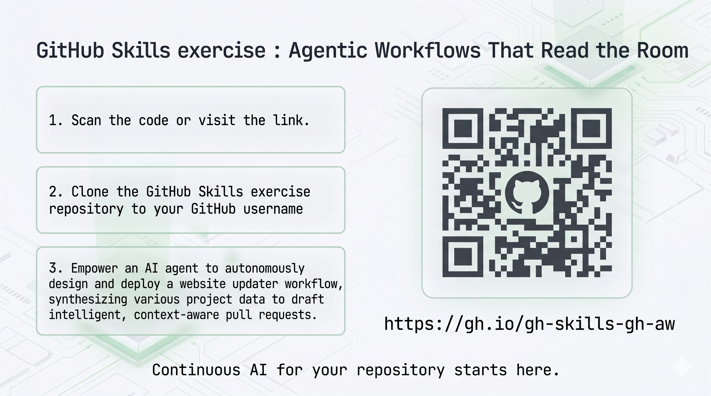
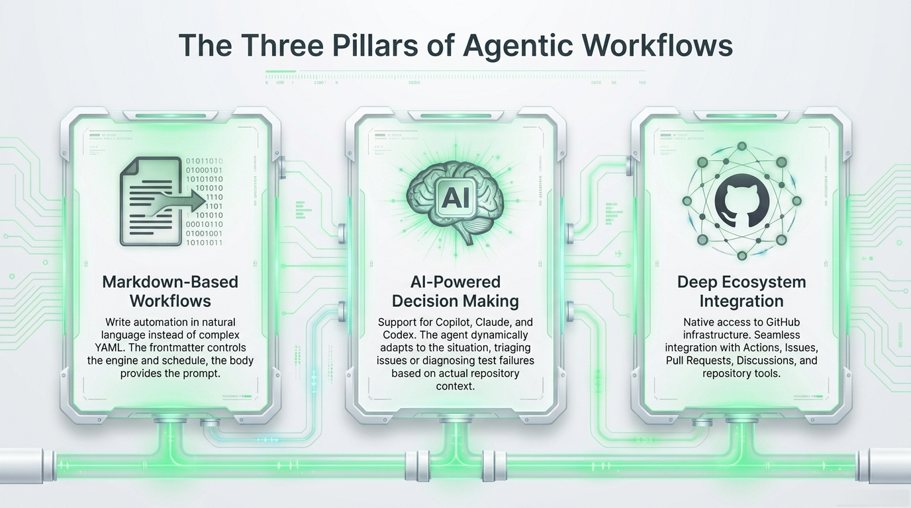
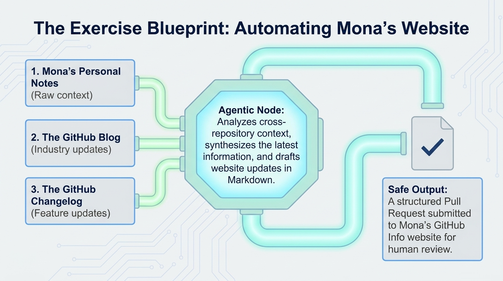

---
<a name="start-building"></a>
<br>
<p align="center">

</p>

# [Microsoft Build 2026](https://build.microsoft.com)

## 🔥 DEM350 - GitHub Agentic Workflows: Automation That Actually Reads the Room

### Session Description

GitHub Agentic Workflows let your repo improve itself. With a simple markdown file and one command, GitHub Actions launches an AI agent to triage issues, fix CI failures, update docs, and improve tests, with no complex YAML required. See a live demo from minimal workflow file to a safe, sandboxed pipeline that delivers a ready‑to‑review PR. Your repo on autopilot, with you in control.

### 🏫 Getting started with the GitHub Skills exercise



To get started with the self-paced GitHub Skills exercise:

1. Scan the QR code or visit the link for the GitHub Skills exercise.
1. Clone the GitHub Skills exercise repository to your GitHub username.
1. Empower an AI agent to autonomously design and deploy a website updater workflow, synthesizing various project data to draft intelligent, context-aware pull requests.

- Exercise link: https://gh.io/gh-skills-gh-aw

> [!NOTE]
> The GitHub Skills exercise environment is self-paced and guided step-by-step in your own consistent codespace development environment. The exercise content is designed to complement the session demo, but you can complete it at your own pace and explore the resources as you like.

### 🧠 Learning Outcomes




By the end of this session, you will be able to:

- **Install agentic workflow setup** — You add the repository workflow that prepares GitHub agentic workflows tooling.
- **Create a website updater** — You draft a workflow for Mona's GitHub Info website that uses repository notes plus the GitHub Blog and GitHub Changelog, and compiles it to a `.lock.yml` workflow file.
- **Add a new source site to the workflow** — You update the workflow to include the [awesome-copilot workflows](https://awesome-copilot.github.com/workflows/) site as a source for `.github/workflows/update-github-info.md` and recompile it.
- **Run the agentic workflow** — You compile Mona's updater, run it, and inspect the pull request it generates.

### 💻 Technologies Used

1. Agentic workflows
1. GitHub Copilot
1. GitHub Actions
1. GitHub Skills

### 📚 Resources and Next Steps

| Resource | Description |
|:---------|:------------|
| [GitHub Skills Exercise: Agentic Workflows That Read the Room](https://github.com/skills/agentic-workflows-that-read-the-room)| A self-paced exercise to practice designing and deploying agentic workflows in your own GitHub repository. |
| [GitHub Blog: Automate repository tasks with GitHub Agentic Workflows](https://github.blog/ai-and-ml/automate-repository-tasks-with-github-agentic-workflows/)| An introduction to GitHub Agentic Workflows, with examples and best practices. |
| [GitHub Agentic Workflows Quick Start](https://github.github.com/gh-aw/setup/quick-start/)| A guide to quickly set up your first agentic workflow. |
| [Creating Workflows](https://github.github.com/gh-aw/setup/creating-workflows/)| Documentation on how to create and customize agentic workflows. |
| [CLI Reference](https://github.github.com/gh-aw/setup/cli/)| Reference for the command-line interface used to manage agentic workflows. |
| [GitHub Skills Exercises](https://learn.github.com/skills)| Explore more GitHub Skills exercises to continue learning and practicing your GitHub skills. |

## Content Owners

<!-- TODO: Add yourself as a content owner
1. Change the src in the image tag to {your github url}.png
2. Change INSERT NAME HERE to your name
3. Change the github url in the final href to your url. -->

<table>
<tr>
    <td align="center"><a href="http://github.com/arilivigni">
        <br />
        <sub><b>Arilivigni</b></sub></a><br />
            <a href="https://github.com/arilivigni" title="talk">📢</a>
    </td>
</tr></table>

### 🌟 Microsoft Learn MCP Server

The Microsoft Learn MCP Server gives your AI agent direct access to Microsoft's official documentation — grounded, up-to-date answers about the products and services covered in this session.

**VS Code** — One click installation: 

[](https://vscode.dev/redirect/mcp/install?name=microsoft-learn&config=%7B%22type%22%3A%22http%22%2C%22url%22%3A%22https%3A%2F%2Flearn.microsoft.com%2Fapi%2Fmcp%22%7D)


**GitHub Copilot CLI** — Run this to install the Learn MCP Server as a plugin:
```
/plugin install microsoftdocs/mcp
```

For more info, other clients, and to post questions, visit the [Learn MCP Server repo](https://aka.ms/learnmcp).

## Contributing

This project welcomes contributions and suggestions.  Most contributions require you to agree to a
Contributor License Agreement (CLA) declaring that you have the right to, and actually do, grant us
the rights to use your contribution. For details, visit [Contributor License Agreements](https://cla.opensource.microsoft.com).

When you submit a pull request, a CLA bot will automatically determine whether you need to provide
a CLA and decorate the PR appropriately (e.g., status check, comment). Simply follow the instructions
provided by the bot. You will only need to do this once across all repos using our CLA.

This project has adopted the [Microsoft Open Source Code of Conduct](https://opensource.microsoft.com/codeofconduct/).
For more information see the [Code of Conduct FAQ](https://opensource.microsoft.com/codeofconduct/faq/) or
contact [opencode@microsoft.com](mailto:opencode@microsoft.com) with any additional questions or comments.

## Trademarks

This project may contain trademarks or logos for projects, products, or services. Authorized use of Microsoft
trademarks or logos is subject to and must follow
[Microsoft's Trademark & Brand Guidelines](https://www.microsoft.com/legal/intellectualproperty/trademarks/usage/general).
Use of Microsoft trademarks or logos in modified versions of this project must not cause confusion or imply Microsoft sponsorship.
Any use of third-party trademarks or logos are subject to those third-party's policies.
